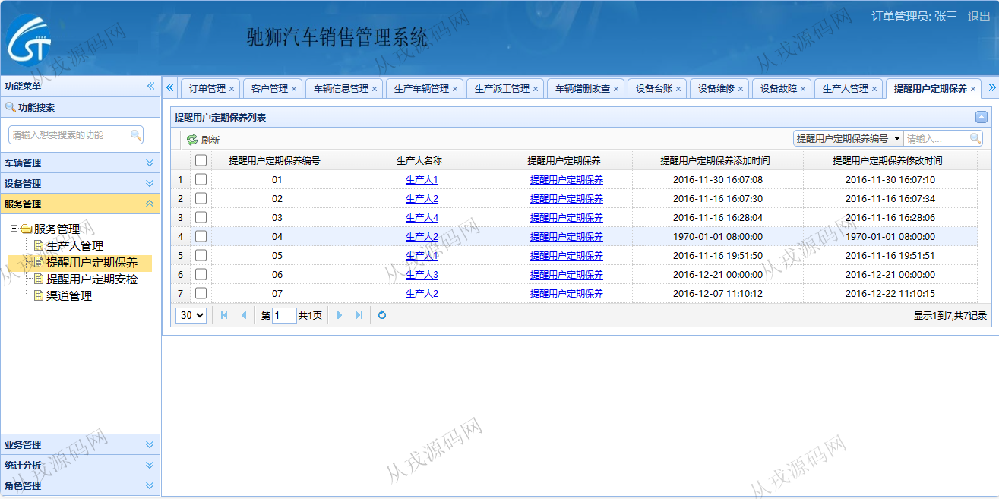

<h1 align="center">130.汽车销售管理系统</h1>

- <b>完整代码获取地址：从戎源码网 ([https://armycodes.com/](https://armycodes.com/))</b>
- <b>技术探讨、资料分享，请加QQ群：692619798</b> 
- <b>作者微信：19941326836  QQ：952045282</b> 
- <b>承接计算机毕业设计、Java毕业设计、Python毕业设计、深度学习、机器学习</b>
- <b>选题+开题报告+任务书+程序定制+安装调试+论文+答辩ppt 一条龙服务</b>
- <b>所有选题地址 ([https://github.com/YuLin-Coder/AllProjectCatalog](https://github.com/YuLin-Coder/AllProjectCatalog)) </b>

## 项目介绍
基于ssm的汽车销售管理系统：前端 jsp、jquery、easyui，后端 maven、springmvc、spring、mybatis；集成车辆管理、设备管理、服务管理、业务管理等功能于一体的系统。

## 功能介绍

- 车辆管理：订单管理，客户管理，车辆信息管理，车辆增删改查，生产车辆管理，生产派工管理
- 设备管理：设备台账，设备中路，设备例检，设备故障，设备维修
- 服务管理：生产人管理，提醒用户定期保养，提醒用户定期安检，渠道管理
- 业务管理：车辆销售管理，业务收入，汽车进货管理
- 统计分析：不合格品管理，成品计量质检，成品计数质检，人员销售数量，热卖汽车类型
- 系统管理：部门管理，员工管理

## 环境

- <b>IntelliJ IDEA 2021.3</b>

- <b>Mysql 5.7.26</b>

- <b>Tomcat 7.0.73</b>

- <b>JDK 1.8</b>

## 运行截图

